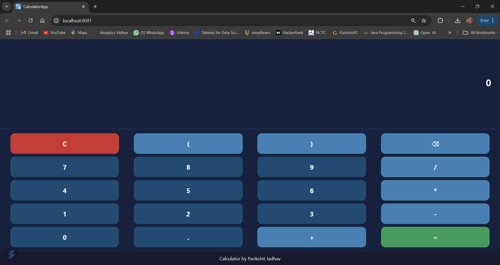
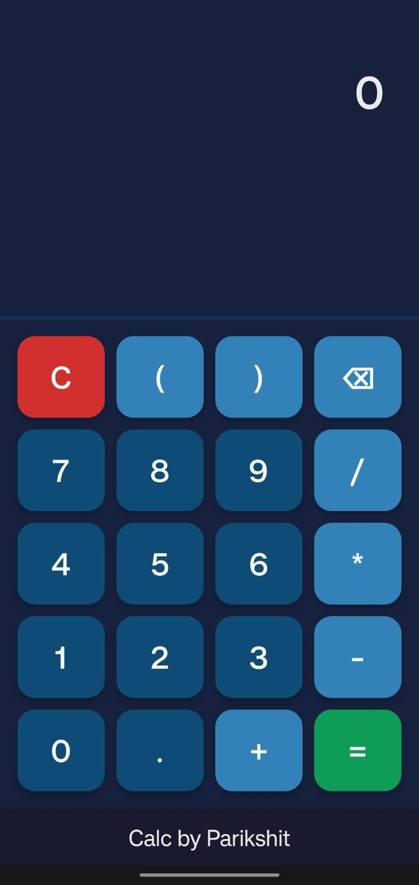

# **Calculator App**  
## **React Native Calculator App**  

A simple and responsive calculator app built with React Native. It features a user-friendly interface for basic mathematical operations and includes enhancements like expression evaluation, digit deletion, and visually distinct input and result displays.

---

## **Features**  

- **Basic Operations**: Perform addition, subtraction, multiplication, and division.  
- **Expression Evaluation**: Enter expressions (e.g., `7+7`) and get results instantly.  
- **Digit Deletion**: Remove the last entered digit with a single tap.  
- **Responsive UI**: Optimized for both Android and iOS devices.  
- **Enhanced Display**:  
  - Input expressions are bold with reduced opacity for clarity.  
  - Results are bold and displayed in black for emphasis.  

---

## **Screenshots**  

### Web App  
  

### Android App  
  
  

---

## **Deployed on Expo Go**  

View and test the app using Expo Go.  

- **To run the app**:  
  Scan the QR code with the Expo Go app or use the following URL:  
  [Expo URL](exp://192.168.31.164:8081)  

Ensure you have Expo Go installed on your mobile device.  

---

## **How to Run the App Locally**  

1. Clone the repository:  
   
   1.`git clone https://github.com/ParikshitJ06/calculator-app.git`
   2.`cd calculator-app`
   3.`npm install`
   4.`npm start`

   
# **To Run on Expo Go App**
 *Initialize the project:*
 
    expo init app-name
    Navigate to the project directory: cd app-name
    Start the project: npm start
    Scan the QR code or enter the code manually in the Expo Go app.

